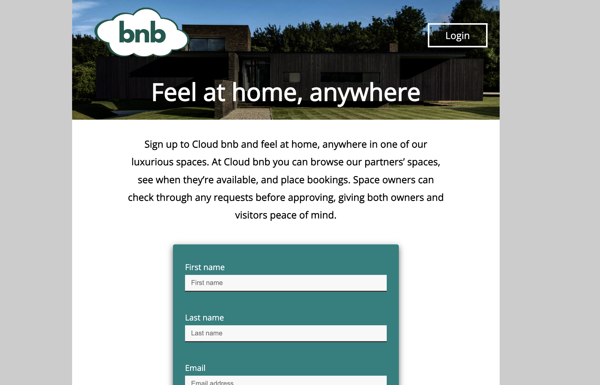
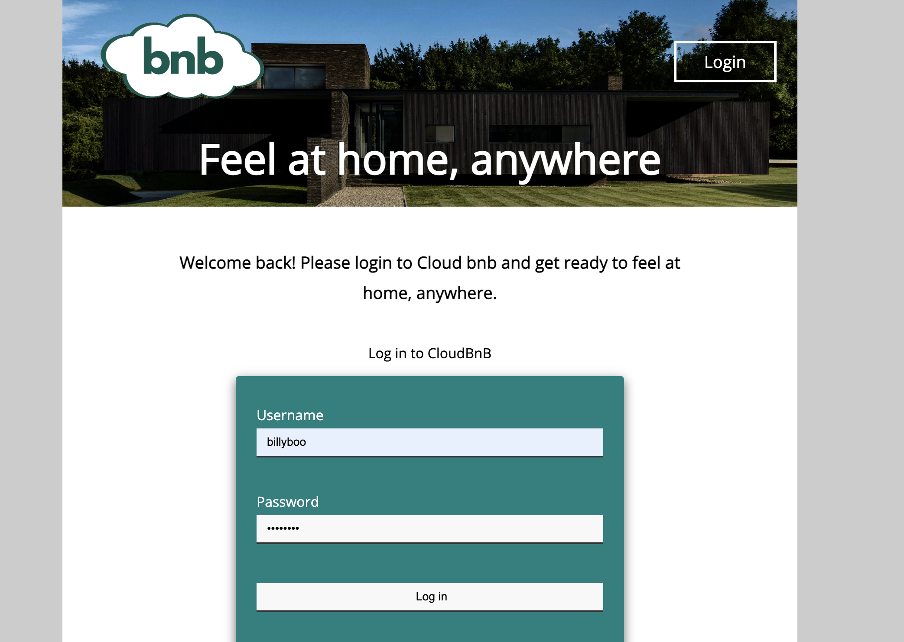
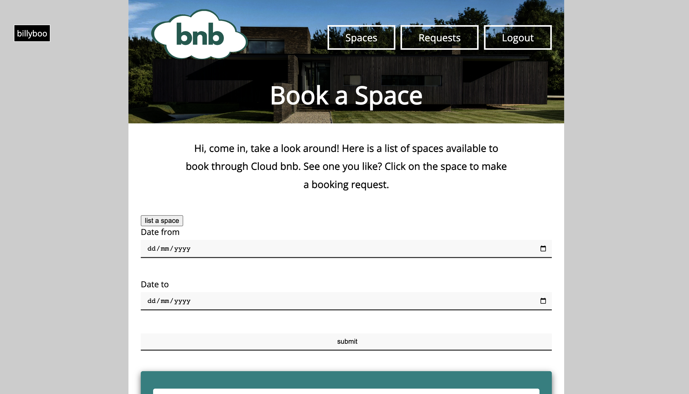
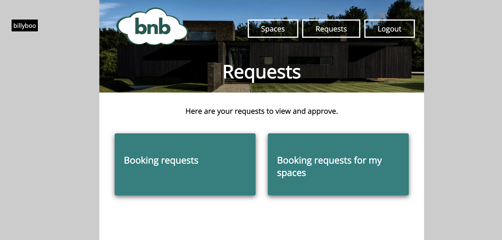

# Cloud BNB

Cloud BNB is an Airbnb clone, built in Ruby (using Active Record, Sinatra and RSpec). <br>

With Cloud BNB you can register, login, list your properties for rent, browse the listed properties, view the availability of properties, and submit booking requests. 

## The Process

We started by desiging our MVP and user stories:
```
As a user 
So that I can use the platform,
I want to be able to sign up.

As a user 
So that I can see all the spaces available to hire, 
I want to be able to login and logout.

As a user , 
When I am logged in, 
I want to be able to list one or multiple spaces.

As a user,
So that my space displays the right information, 
I want to be able to name my space, provide a description, and price per night.

As a user with a space listed,
So that my space has availability options, 
I want to be able to provide dates that it is available to rent.

As a user logged in, 
So that I can make a booking request, 
I want to be able to see the dates available for spaces. 

As a user logged in, 
So that I can make bookings, 
I want to be able to request to hire a space for a period of time. 

As an owner of a space, 
So that I can keep track of the booking requests made to my space, 
I want to be able to see all the booking requests in one place.

As an owner of a space, 
So that I can confirm a booking request, 
I want to be able to approve or deny booking requests to my space.

As an owner of a space, 
So that I can keep track of booking requests made to my space, 
I want to be notified by email when a space has been booked.

As a user, 
So that I know if my booking has been approved, 
I want to recieve an email confirming my booking.

As a user, 
So that I can keep track of all my bookings, 
I want to see which spaces I have made booking requests to. 

```

Once we had our user stories built out, we designed our database system.


# How To Run 

### Set up

```bash
# Install gems
bundle install

# Run the tests
rspec

# Run the server (better to do this in a separate terminal).
rackup
```

### Database

To set up the database on your local machine:

```bash
# make sure all dependencies are downloaded
bundle install

# create the databases on your machine
rake db:create

# create the tables from our migrations
rake db:migrate
rake db:migrate RACK_ENV="test"

# populate the tables with test data
rake db:seed
rake db:seed RACK_ENV="test"
```

Now if you check the tables in TablePlus you should see that the databases have been added (for both development and for test) and that the tables are now populated with dummy data.

Once you have installed and run the dependencies, in the directory, run ```rackup``` and navigate in your browser to http://localhost:9292/ where you will be able to see Cloud BNB in action. 

### Screengrabs of Cloud BNB in Action





## What's Left
To build out the program further, we would: 
* Style the bookings page
* Add approve/deny buttons to booking requests
* Add images to spaces
* Add the availability in a calendar format


